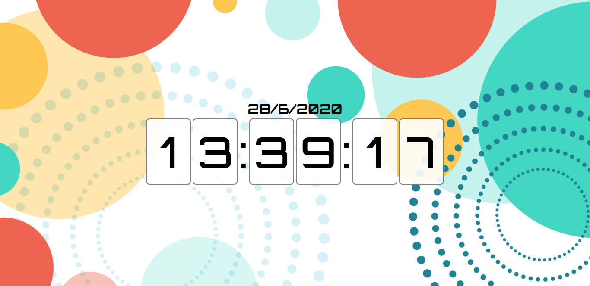
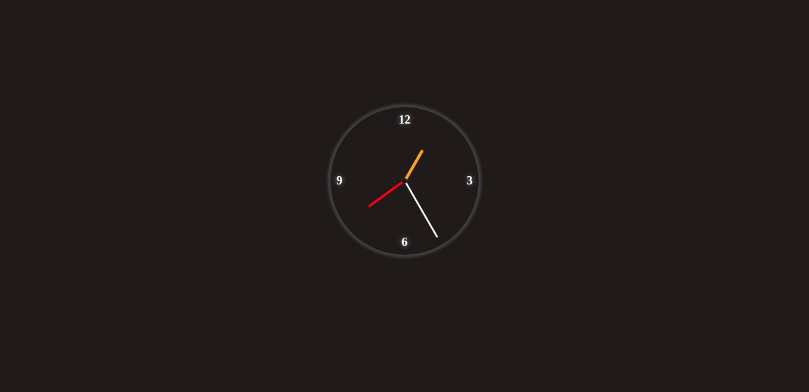
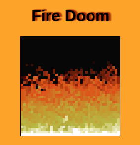
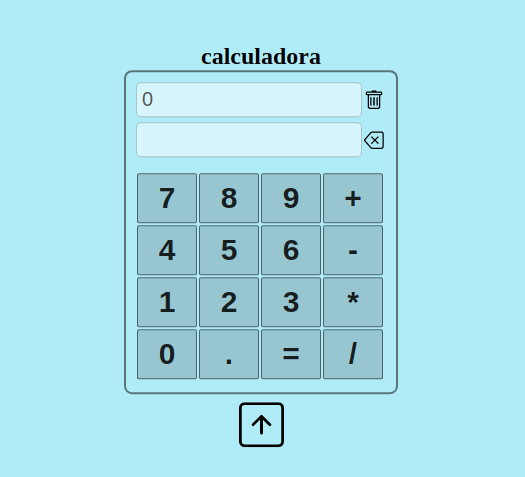
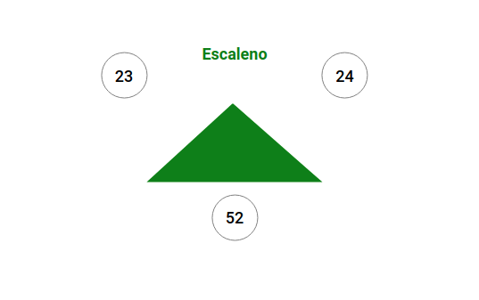
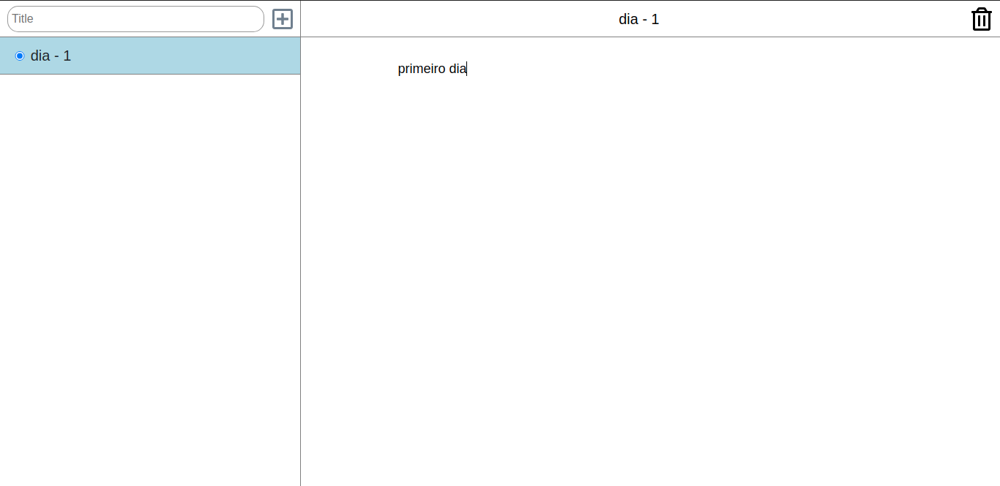
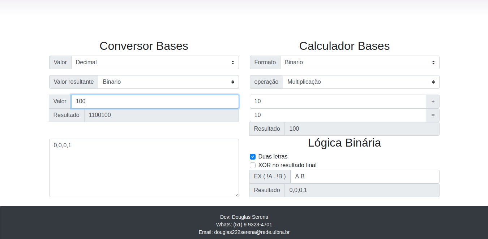

<h1 align="center">Simplas pages</h1>

  Este repositorio esta destinado a guardar todos os projetos de paginas unica.

<h4 align="center">Clock</h4>

<h6 align="center"> Este projeto possui dois modelos um relogio digital e outro analogico</h6>

  

  

<a href="https://douglasserena.github.io/simplas-pages/clock/analog/">Analog</a> -
<a href="https://douglasserena.github.io/simplas-pages/clock/digital/">Digital</a>

<h4 align="center">Fire Doom</h4>

  

<a href="https://douglasserena.github.io/simplas-pages/FireDoom">Fire Doom</a>

<h4 align="center">Calculator</h4>

  

<a href="https://douglasserena.github.io/simplas-pages/calculator">Calculator</a>

<h4 align="center">Triangle</h4>

  

<a href="https://douglasserena.github.io/simplas-pages/triangle">Triangle</a>

<h4 align="center">Note</h4>

  

<a href="https://douglasserena.github.io/simplas-pages/note">Note</a>

<h4 align="center">Binario</h4>

  

<a href="https://douglasserena.github.io/simplas-pages/binario">Binario</a>

